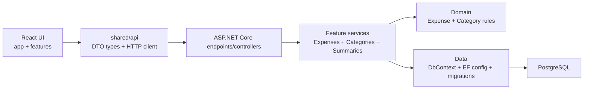
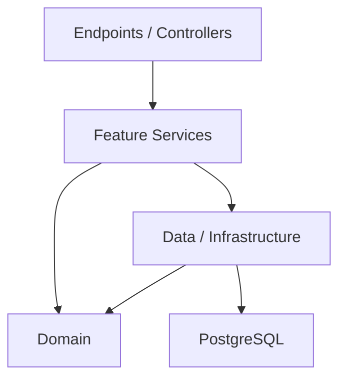
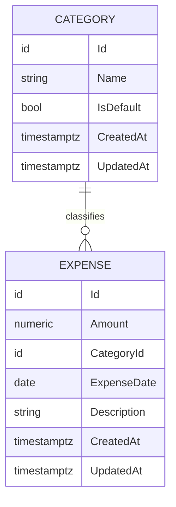
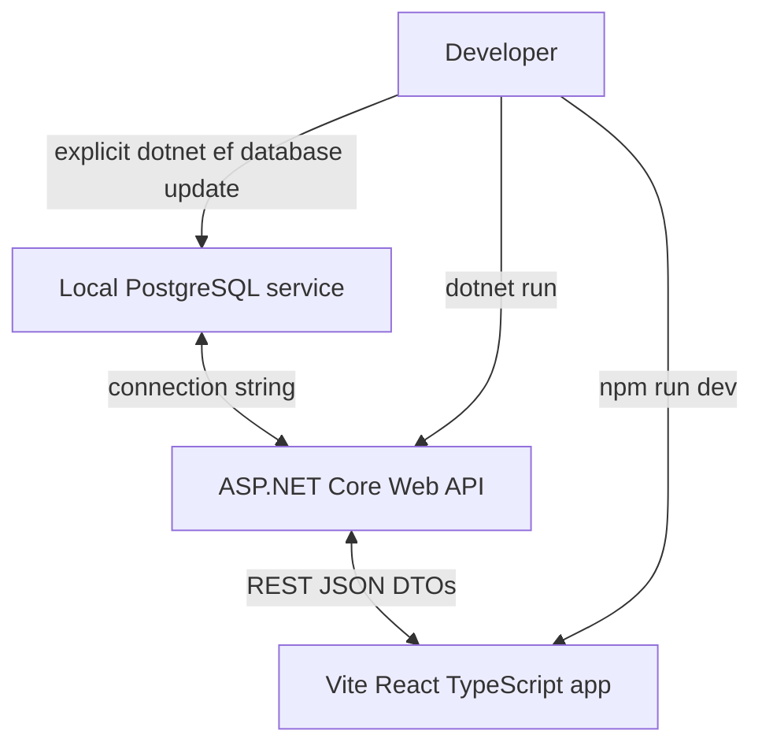

# Architecture Spine - bmad-expense-tracker

## Design Paradigm

Use a pragmatic layered full-stack split: React/Vite TypeScript frontend, ASP.NET Core Web API backend, and PostgreSQL persistence. Boundaries are intentionally small and educational: the frontend owns UI composition and server-state orchestration; the API owns contracts and validation; feature services own business behavior; Domain owns core entities/rules; Data owns EF Core persistence.



## Invariants & Rules

### AD-1 - Full-Stack Split Application [ADOPTED]

- **Binds:** all MVP capabilities
- **Prevents:** frontend-only, backendless, or persistence-light implementations that skip the intended API, validation, and PostgreSQL learning goals
- **Rule:** Build the MVP as React frontend + ASP.NET Core Web API + PostgreSQL. UI, API contracts, business rules, and persistence must remain separately identifiable implementation concerns.

### AD-2 - Single Backend Project With Internal Layers [ADOPTED]

- **Binds:** backend implementation
- **Prevents:** premature multi-project Clean Architecture ceremony and controller/data-layer business-rule scattering
- **Rule:** The backend is one deployable ASP.NET Core Web API project organized internally around `Features/Expenses`, `Features/Categories`, `Domain`, `Data` or `Infrastructure`, and `Common` only where genuinely needed. Do not introduce separate Application/Core/Infrastructure projects without a concrete later requirement.

### AD-3 - Backend Dependency Direction [ADOPTED]

- **Binds:** backend implementation
- **Prevents:** HTTP endpoints, EF Core configuration, and domain behavior depending on each other inconsistently
- **Rule:** Endpoints/controllers stay thin and call feature/application services. Feature services coordinate validation, domain rules, and persistence. Domain must not depend on ASP.NET Core or EF Core. Data owns `DbContext`, EF configurations, migrations, and provider-specific persistence.



### AD-4 - Feature-First TypeScript Frontend [ADOPTED]

- **Binds:** frontend implementation
- **Prevents:** screen-by-screen organization, ad hoc shared folders, and soft frontend/backend contracts
- **Rule:** Frontend application code is TypeScript-first and organized as `app`, `features/expenses`, `features/categories`, `shared/ui`, and `shared/api`. API request/response DTO types live in `shared/api`; raw backend response shapes must not leak directly across UI components.

### AD-5 - Frontend State Ownership [ADOPTED]

- **Binds:** frontend data flow
- **Prevents:** duplicating server data in global client stores or over-centralizing local UI state
- **Rule:** TanStack Query owns API-backed server state: Expenses, Categories, Current Month summary, and related mutations. React state/hooks own local UI state such as forms, dialogs, and temporary selections. React Router owns navigation state. Do not add Redux, Zustand, or another global client store in the MVP.

### AD-6 - Explicit API DTO Contracts [ADOPTED]

- **Binds:** API, backend, frontend contracts
- **Prevents:** EF/domain entities becoming the public API and persistence changes breaking UI contracts
- **Rule:** Every endpoint uses explicit request/response DTOs. Do not expose EF Core/domain entities directly. Keep DTOs close to their feature where practical and map explicitly between DTOs and entities.

### AD-7 - Resource-Oriented REST Without Mediator Framework [ADOPTED]

- **Binds:** API shape
- **Prevents:** CQRS/MediatR ceremony for CRUD workflows and incompatible route conventions
- **Rule:** Use resource-oriented REST endpoints for Expenses and Categories plus `GET /api/summaries/current-month`. Controllers/endpoints delegate behavior to feature services. Do not introduce CQRS, MediatR, or another mediator framework in the MVP.

### AD-8 - Category Identity Model [ADOPTED]

- **Binds:** data model, API behavior, category UX
- **Prevents:** divergent historical-label versus live-category semantics
- **Rule:** `Category` is a first-class entity. `Expense` stores `CategoryId` as a foreign key and does not snapshot category name. Renaming a Category preserves existing Expense associations.

### AD-9 - Protected Default Categories [ADOPTED]

- **Binds:** category management, data integrity
- **Prevents:** orphaned Expenses, missing starter categories, or automatic category reassignment
- **Rule:** Default Categories are seeded database rows protected from edit/delete. Custom Categories can be created, renamed, and deleted only when unused. Category deletion referenced by Expenses must be blocked by business rule and FK integrity.

### AD-10 - Money Uses Decimal/Numeric [ADOPTED]

- **Binds:** Expense amounts, totals, category breakdowns
- **Prevents:** floating-point rounding drift in monetary values
- **Rule:** Monetary values use .NET `decimal` and PostgreSQL `numeric(12,2)`. Floating-point types are forbidden for amounts and summaries.

### AD-11 - Date and Time Semantics [ADOPTED]

- **Binds:** Expense ordering, Current Month filtering, API contracts
- **Prevents:** mixing user occurrence dates with record timestamps or browser/server timezone drift
- **Rule:** `ExpenseDate` is the user-selected occurrence date, stored as .NET `DateOnly` mapped to PostgreSQL `date`. `CreatedAt` and `UpdatedAt` are UTC timestamps mapped to `timestamptz`; `CreatedAt` is the same-date ordering tie-breaker. Backend uses fixed application timezone `Asia/Kolkata` for Current Month and "today" semantics. API dates use `YYYY-MM-DD`; timestamps use ISO 8601.

### AD-12 - On-Demand Current Month Summary [ADOPTED]

- **Binds:** Current-Month Spending Summary
- **Prevents:** inconsistent denormalized summary state after Expense create/update/delete
- **Rule:** `GET /api/summaries/current-month` calculates summary data on demand in the backend from normalized Expenses and Categories. No summary table, materialized view, background aggregation, or caching in the MVP. The response includes `monthStart`, `monthEnd`, `totalAmount`, `categoryBreakdown`, and `recentExpenses`.

### AD-13 - Backend-Owned Summary Logic [ADOPTED]

- **Binds:** Home summary, Recent Expenses, category breakdown
- **Prevents:** frontend-side financial aggregation or divergent Current Month rules
- **Rule:** Backend filters Expenses by `ExpenseDate` within the `Asia/Kolkata` current calendar month, groups by `CategoryId`, resolves Category names, returns nonzero categories ranked by amount descending, and returns Recent Expenses ordered by `ExpenseDate` descending then `CreatedAt` descending.

### AD-14 - Validation and Error Contract [ADOPTED]

- **Binds:** forms, API errors, data integrity
- **Prevents:** trusting client validation and incompatible error handling conventions
- **Rule:** Frontend performs immediate UX validation, but backend repeats required validation and is authoritative for data integrity/business rules. API errors use ASP.NET Core `ProblemDetails` and `ValidationProblemDetails` with appropriate HTTP status codes. No custom error envelope in the MVP.

### AD-15 - Single-User No-Auth MVP [ADOPTED]

- **Binds:** API, data model, service boundaries
- **Prevents:** fake multi-user architecture without an identity mechanism
- **Rule:** The MVP has no login, registration, sessions, authorization policies, User table, UserId columns, or hardcoded current user. Treat the locally running app as belonging to one user. Introduce authentication and user ownership later only with a real identity requirement.

### AD-16 - Testing Strategy Is Architectural [ADOPTED]

- **Binds:** implementation verification
- **Prevents:** untested architectural boundaries and missed PostgreSQL-specific behavior
- **Rule:** Backend unit tests cover business/domain rules. Backend integration tests cover API + EF Core + PostgreSQL behavior with Testcontainers PostgreSQL for persistence-sensitive scenarios. Frontend tests cover meaningful component/form validation and interactions. E2E tests stay few and cover critical user journeys. Do not target 100% coverage, and do not substitute SQLite/in-memory EF tests where PostgreSQL behavior matters.

### AD-17 - Local Development Envelope [ADOPTED]

- **Binds:** developer setup
- **Prevents:** implementation stories assuming containerized local app infrastructure or hidden database mutation
- **Rule:** PostgreSQL runs locally as an installed service/application. Frontend runs as a Vite dev process. Backend runs as an ASP.NET Core dev process. Backend config supports appsettings plus environment variables/user-secrets. EF Core migrations are committed and applied explicitly by developers; the app must not auto-run migrations on startup.

## Consistency Conventions

| Concern | Convention |
| --- | --- |
| Backend feature folders | `Features/Expenses`, `Features/Categories`, `Features/Summaries` only if a separate summary feature folder improves clarity. |
| Backend contract names | Use operation-specific DTO names such as `CreateExpenseRequest`, `UpdateExpenseRequest`, `ExpenseResponse`, `CreateCategoryRequest`, `UpdateCategoryRequest`, `CategoryResponse`, `CurrentMonthSummaryResponse`. |
| Frontend API types | Keep DTO types and API functions in `shared/api`; feature UI imports those types/functions rather than hand-shaping raw responses. |
| Entity ids | Use backend-generated ids consistently across DTOs and entities; exact id type is [ASSUMPTION] `Guid` unless implementation selects a simpler numeric id before first migration. |
| Amounts | Amounts are INR application-level values, represented as decimal/numeric with two decimal places. No per-expense currency. |
| Dates | Dates are `YYYY-MM-DD`; timestamps are ISO 8601 UTC. |
| Errors | Use `ProblemDetails` / `ValidationProblemDetails`; frontend maps field errors inline. |
| Categories | Default Categories are seeded and protected. Custom Categories are mutable unless referenced by Expenses for delete. |

## Stack

| Name | Version |
| --- | --- |
| Node.js | 24.21.0 LTS |
| React | 19.3 |
| Vite | 8.3.0 |
| TypeScript | 7.0.2 |
| TanStack Query | 5.102.8 |
| React Router | 8.4.0 |
| ASP.NET Core / .NET | 10.0.12 LTS |
| EF Core | 10.0.12 |
| Npgsql.EntityFrameworkCore.PostgreSQL | 10.0.3 |
| PostgreSQL | 18.6 |
| Vitest | 5.0.1 |
| React Testing Library | 16.3.3 |
| Playwright Test | 1.63.0 |
| Testcontainers.PostgreSql | 4.15.0 |

## Structural Seed

```text
/
  frontend/
    src/
      app/                  # routing, providers, layout composition
      features/
        expenses/           # Home, Review, Detail/Edit, expense forms/hooks
        categories/         # category management and category selection
      shared/
        api/                # DTO types, HTTP client, API functions
        ui/                 # reusable UI primitives only
  backend/
    Features/
      Expenses/             # endpoints/controllers, DTOs, services for Expenses
      Categories/           # endpoints/controllers, DTOs, services for Categories
      Summaries/            # current-month endpoint/service if separated
    Domain/                 # Expense, Category, domain/business rules
    Data/                   # DbContext, EF configurations, migrations
    Common/                 # cross-cutting helpers only when genuinely needed
  tests/
    backend-unit/
    backend-integration/
    e2e/
```





## Capability -> Architecture Map

| Capability / Area | Lives in | Governed by |
| --- | --- | --- |
| FR-1 to FR-4 Expense Recording | `features/expenses`, `Features/Expenses`, `Domain`, `Data` | AD-1, AD-3, AD-5, AD-6, AD-10, AD-11, AD-14 |
| FR-5 to FR-8 Expense Review and Maintenance | `features/expenses`, `Features/Expenses`, `Data` | AD-4, AD-6, AD-7, AD-11, AD-14 |
| FR-9 to FR-13 Category Management | `features/categories`, `Features/Categories`, `Domain`, `Data` | AD-8, AD-9, AD-14 |
| FR-14 to FR-17 Current-Month Spending Summary | `features/expenses` Home summary, `Features/Summaries` or `Features/Expenses`, `Data` | AD-11, AD-12, AD-13 |
| UX fast mobile-first capture | `features/expenses` form and Home layout | AD-4, AD-5, DESIGN/EXPERIENCE sources |
| Single-user learning MVP | API/data model | AD-15, AD-17 |
| Automated verification | test projects/suites | AD-16 |

## Deferred

| Deferred Decision | Revisit When |
| --- | --- |
| Production hosting, CI/CD, environment topology, and deployment automation | A deployment target becomes part of the learning or product goal. |
| Authentication, authorization, User entity, and per-user data ownership | The product needs real login or multi-user use. |
| Advanced observability beyond basic ASP.NET Core logging and frontend console/dev tooling | The app is prepared for shared/hosted use or production troubleshooting. |
| Caching/materialized summaries/background aggregation | Measured performance on realistic data requires optimization. |
| Docker/Docker Compose for local app development | Local installed PostgreSQL becomes a burden or team portability becomes a real need. |
| Per-expense currency, exchange rates, imports, receipt/OCR, advanced analytics | A later PRD update expands the MVP scope. |
| Exact id type | Before the first EF Core migration if `Guid` is not desired. |
